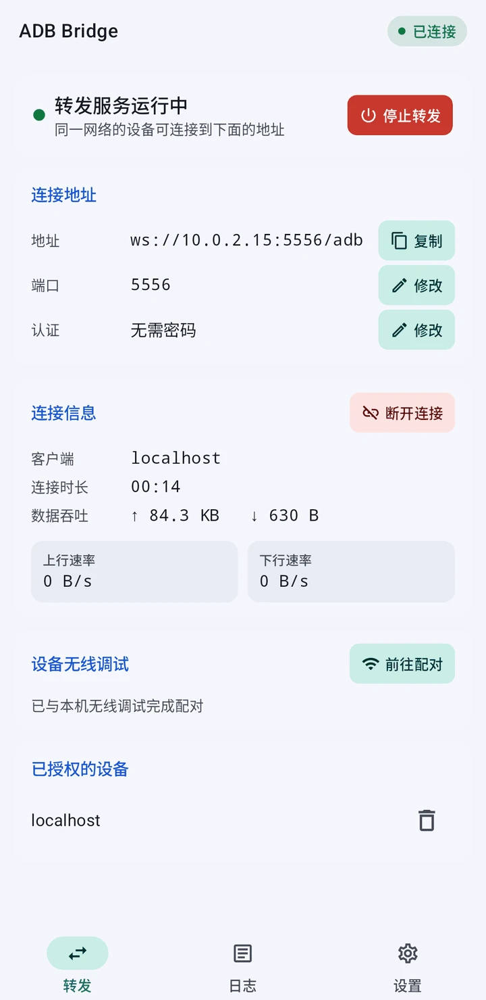
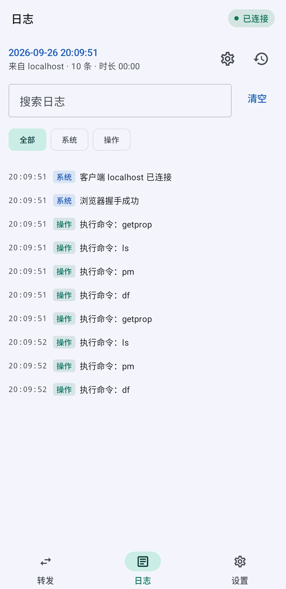
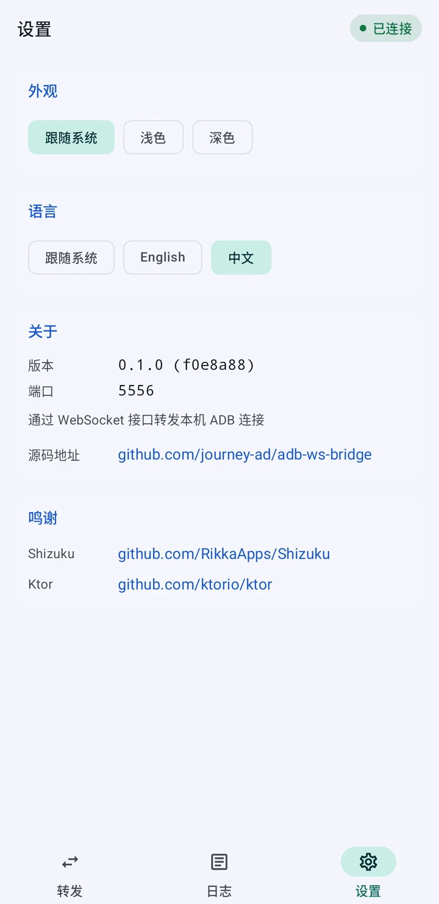

<p align="right">
  <sub>中文文档 | <a href="README_EN.md">English</a></sub>
</p>

# ADB Bridge

ADB Bridge 是一款在 Android 设备上运行的 ADB 转发工具。它与本机无线调试完成配对后，在局域网内提供 WebSocket 接口，把浏览器里 ADB 客户端的请求转发到设备自身的 adbd，无需在电脑上安装 adb。

<p align="center">
  <a href="https://count.getloli.com" target="_blank">
    
  </a>
</p>

## 界面

<p align="center">
  
  
  
</p>

## 工作方式

应用先与设备自身的无线调试完成配对：mDNS 发现 `_adb-tls-pairing._tcp` 服务的端口，在通知里填入系统给出的 6 位配对码即可完成握手，生成的 RSA 密钥保存在本机，之后长期可用。

启动转发后，应用通过 mDNS 找到无线调试的连接端口，在指定端口上运行 WebSocket 服务。浏览器连接到 `ws://设备地址:端口/adb` 后，应用为该连接建立一条到本机 adbd 的隧道，此后的字节在两端之间透传。

同一时刻只接受一个连接。新客户端首次连接时需要在设备上确认，已授权的客户端直接放行；开启连接密码后，浏览器还需在地址中带上正确密码。

## 核心特性

- 通过 mDNS 发现无线调试的配对端口与连接端口，配对码在通知中填写
- RSA 密钥在本机生成并保存，配对一次后无需重复
- 基于 Ktor 的 WebSocket 服务，端口可修改，默认 5556
- 新客户端需在本机确认，已授权的客户端直接放行，可在设置中撤销
- 可选连接密码，浏览器连接时校验
- 连接信息实时展示客户端、连接时长与上下行速率
- 快捷设置磁贴一键开关转发，长按打开应用
- 桌面小组件显示运行状态与连接地址，可就地启停
- 日志按连接归档为会话，支持搜索、查看详情与删除，连接会话最多保留 20 次
- 日志可只保留在内存，关闭后不写入存储
- 中文与 English 界面，浅色与深色主题
- 基于 Jetpack Compose 和 Material 3 的界面设计

## 前置要求

- Android 11 (API 30) 及以上
- 系统设置里的无线调试可用，并已与本应用完成配对
- 客户端与设备处于同一局域网

## 构建

```bash
./gradlew assembleRelease
```

调试包的 applicationId 带 `.debug` 后缀，可与发布版本共存：

```bash
./gradlew assembleDebug
```

单元测试与静态检查：

```bash
./gradlew testDebugUnitTest lintDebug
```

仓库内的 GitHub Actions 在推送与拉取请求时执行检查与调试构建，推送 `v*` 标签时构建签名发布包并创建 Release。

## 鸣谢

- [Shizuku](https://github.com/RikkaApps/Shizuku)：ADB 协议与配对实现
- [Ktor](https://github.com/ktorio/ktor)：WebSocket 服务端

## 许可证

[MIT LICENSE](LICENSE)
